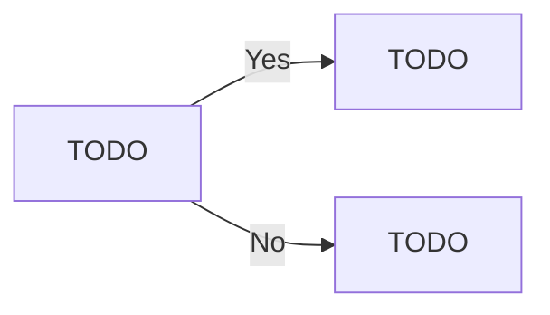

# Content

Welcome to this tutorial on building a First-Person Shooter (FPS) game using Godot. 

This tutorial is designed to guide you through the process of creating an FPS game from scratch, providing step-by-step instructions and explanations along the way.  Godot is a powerful, open-source game engine that is highly flexible and customizable, making it an excellent choice for game development. It supports a variety of platforms and offers a unique and intuitive scene system.  In this tutorial, we will cover key aspects of game development such as setting up the player character, implementing movement and shooting mechanics, creating enemies, and designing levels. We will also delve into more advanced topics such as raycasting and scripting.  By the end of this tutorial, you will have a fully functional FPS game that you can further customize and expand upon. Whether you're a seasoned developer or just starting out in game development, this tutorial will provide valuable insights into the process of creating an FPS game in Godot.  Please note that this tutorial is written for Godot v3.5.1. If you're using a different version of Godot, some steps may vary.  Let's get started!

> These instructions are written for Godot v3.5.1
> {style="note"}

## Main Menu {id="MainMenu"}

### Create the Main Menu Scene

Click on the 2D Scene option under Create Root Node.


Rename the Node “Main Menu”


Right Click on the Main Menu Node and choose “Create Child Node” and add a Button.


Set the Text of the button to “Play” or whatever you want.


Right-click on the Button node and choose Attach Script. Change the name of the script to `SceneChange.gd` as this may be used in different circumstances.


With the button selected, change to the Node tab and double click the `pressed()` signal.


Select the Button in the list and click Connect.


Save the Scene as `MainMenu.tscn`.

<include from="reusableContent.topic" element-id="commitPush"/>

### Create the Game Scene

Choose Scene→New Scene. And Choose 3D Scene as the root Node.


Rename the scene node appropriate for your game.


Save the scene, naming it appropriate to your game.


### Create a Button


> You can configure the main menu in any way you want, displaying the button/s wherever you want. These steps just show creating the button and the functionality.
> {style="note"}

Right click on the Main Menu node and create a child Button node.


Right-click on the button and Attach a Script. Call this script `SceneChange.gd`. This script will be used for any and all scripts where the button changes scenes.


With the button selected, click on the Node tab, next to the Inspector, and double click on the `pressed(`) signal.


Make sure Button is selected in the “Connect To script” section. Leave the Receiver Method as is, and just click connect.


At the top of the script after the `extends` line, add `export(String) var scene_to_load.`

Change the `pass` line of code to `get_tree().change_scene(scene_to_load)`.


<include from="reusableContent.topic" element-id="commitPush"/>


### Link the Main Menu to the Game Scene.

Open the Main Menu scene.

Right-Click on the game scene you just saved in the FileSystem tab and choose Copy Path.


Paste that Path into the `Scene To Load` field for the Button created earlier.


### Run the Game

Press the play button to run the game. If this is the first time the project has been run, you’ll be asked to choose a Main Scene.

If the Main Menu Scene is open, you can just choose Select Current.

If you have another scene open, choose Select, and then double-click on the `MainMenu.tscn`.


<procedure title="Changing Starting Scene" collapsible="true">
    <step>Changing the Starting Scene can be set in the Project Settings</step>
    <step>Screen_Shot_2022-08-05_at_10.55.43_am.png</img>
</step>
</procedure>


### Continue developing the Main Menu

Once the initial configuration is complete (connecting the main menu to the first game scene, you are free to improve the main menu as much as you want. Add `VBoxContainers` and `HBoxContainers` to organise the layout to assist with placement of items.

- Add Headings and graphics. 
- The Main menu developed can be continued in the future at any stage of the development process.

## Environment - Rapid Development

### Create a Floor

To start with, the player will need to walk on something, so the first step is to create a `MeshInstance` which will be the floor of the room where the player starts.

Right-Click on the Game scene and choose Add Child Node. Search for Mesh Instance.


Rename the node “Floor” or “Ground” or whatever is appropriate.


In the Inspector, look for the Mesh attribute. in the dropdown box, choose `New PlaneMesh`.

At this stage, the mesh is there, but the player (created later) will fall straight through it.


With the mesh selected, go to the Mesh Menu and choose Create Trimesh Static Body.


This updates the mesh to include 2 child nodes.


Currently, the floor is quite small. The player object that will be created later will be quite significantly larger, so the relative scale will need to be addressed.

Edit the mesh.


Set the x and y size values to something larger. In this case, 20 has been used. This may need to be modified at a later date.


### Texture the floor

> A Texture is simply an image that’s applied to a mesh.
> {style="note"}

Find an image to suit the environment appropriate for the game.

> TIP: When googling, add the word “seamless” to your image searches. This means that the edges of the image align with the opposite side, meaning that when the image is tiled on a mesh, no edging will be visible.
> {style="note"}


In the inspector, expand out the Material dropdown.


There is currently no material attached, hence why the mesh is white. Click on the dropdown next to [empty] and choose New Spatial Material.


In the menu that appears, expand `Albedo`.

> Albedo is the default type for textures. There are many more as you can see in the list.
> {style="note"}


Drag the texture from the FileSystem tab to the Texture option under Albedo. The texture on the plane has been updated.


> This is the same process to texture any of your other assets, unless they’ve been textured prior to importing.
> {style="note"}

The texture can be ‘tiled’ instead of stretched, by editting the x and y values under `Uv 1`.

Choose values that suit the needs of the game and the desired effect.


### Add Lighting

The scene at this stage is too dark for the player. Right click on the Root Node, choose Add Child Node, search for and add a `DirectionalLight`.


With the `DirectionaLight` selected, enable Shadows in the Inspector.

Set the Rotational Degrees so that the light is roughly coming down from ‘the sky’ and creates the appropriate shadows.

The exact values don’t matter.


### Build your Environment

Find, import and put your environment models into your scene.

You may wish to add walls, or fences.

At this stage, keep it simple and get a good example of your first scene.

Similar to the Main Menu, the environment can be further developed at a later stage of the development process.

## First-Person Player Scene

As this game is a First-Person Shooter, there is no need to create a mesh for the player object; as in the game, the player will never see it.

Therefore, the player object can be initially created with a simple collider and camera.

There are two main steps to creating the player:

1. Making the player scene, creating nodes etc, and
2. Coding the functionality.

### The Player Scene

Create a new Scene.

Create the root node as `KinematicBody`. To do this, click on Other Node and search for `KinematicBody` and choose Create.

Save the scene as `Player.tscn`.


Add a child node—`CollisionShape`.

This will represent the boundaries of the player node in the game. It will be used as the players ‘hit box’ (officially the **collider**) to detect collisions - walls, floors, projectiles etc.


With the CollisionShape selected, create a new Capsule Shape.


Rotate the capsule so it’s vertical (to represent the boundaries of the player).


Resize the dimensions of the capsule, but clicking drop down box next to Capsule Shape and choose Edit.


Set the Radius and height to values that suit your game.

> You may find these values need to be modified later to better suit your game.
> {style="note"}


### Camera

The player has been created, however, the player cannot ‘see’ as a camera has not been added. The camera is what the user sees in game. In a FPS, the mouse is attached to the player object and therefore the camera. When the mouse moves, the camera moves to match.

Add a Camera child node to the Player node.


Set the Environment attribute to the `default_env.tres` already created in the project.


Set this camera to be the ‘main’ camera by setting the Current attribute to True.


Move the camera up the ‘body’ to appear as if the camera ‘sees’ through the players eyes.

> Exact value is not critical, but it has to suit your capsule size set earlier.
> {style="note"}

Only change the `Y` value. This is the vertical value. The coordinate system will be discussed at a later time.


### Key Actions

Before any scripting can be done, some keyboard and mouse inputs need to be mapped to actions (to be coded later).

<procedure title="Set Input Keys" id="inject-a-procedure">
    <step>
        <p>Open the `Project` menu</p>
    </step>
    <step>
        <p>Select Project Settings</p>
    </step>
    <step>
        <p>Select Input Map</p>
    </step>
</procedure>

Add the following actions and set the keys and mouse inputs as directed.

`player_forward`

`player_backward`

`player_left`

`player_right`

`jump`

`shoot`

> Pay close attention to the spelling and capitalisation. These will be linked to in the script later.
> {style="note"}


### Mouse Look

Open `Player.tscn`. Right click on the root node and attach a script. Leave the settings as they are, and click Create.


Clear out the commented code, and add some variables which will be used later in the script.

These variables define how fast the player moves and how jumping and gravity impact the players movement.


```
extends KinematicBody

# Physics
var movementSpeed = 1.0 		# How fast the player can move.
var jumpStrength = 1.0 		# How much force used to make player jump
var gravity = 10.0			# Gravity's strength.

# Called when the node enters the scene tree for the first time.
func _ready():
    pass # Replace with function body.
```
{collapsible="true"}

Add other variables. These variables define the player movement and camera movement limitations.


```
# cam look
var minCamVerticalAngle = -90.0		# Limit camera view to straight down.
var maxCamVerticalAngle = 90.0		# Limit camera view to straight up.
var lookSensitivity = 0.5			# How fast camera moves. 'mouse sensitivity'. 

# vectors
var playerVelocity : Vector3 = Vector3() 	# Players Velocity
var mouseDelta : Vector2 = Vector2()			# How much the mouse has moved since last frame refresh.

# player components
onready var camera = get_node("Camera")		# "attach" the camera to access from script.
```
{collapsible="true"}


Add the function to detect mouse movement.


```
# called when an input is detected
func _input (event):
    # did the mouse move?
    if event is InputEventMouseMotion:
        mouseDelta = event.relative
```
{collapsible="true"}


Add the function to rotate the camera to match the mouse movements.


```
# called every frame
func _process (delta):
    # rotate camera along X axis
    camera.rotation_degrees -= Vector3(rad2deg(mouseDelta.y), 0, 0) * lookSensitivity * delta
    # clamp the vertical camera rotation
    camera.rotation_degrees.x = clamp(camera.rotation_degrees.x, minCamVerticalAngle, maxCamVerticalAngle)
  
    # rotate player along Y axis
    rotation_degrees -= Vector3(0, rad2deg(mouseDelta.x), 0) * lookSensitivity * delta
  
    # reset the mouse delta vector
    mouseDelta = Vector2()
```
{collapsible="true"}


At this stage, you can run the game to test the mouse movement. Run the project, click the button on the main menu to play the game, and you should be able to look around your environment.


### Player Movement

Add the `_physics_process` function for player movement. This function can go at the bottom of the `Player.gd` script.


```
# called every physics step
func _physics_process (delta):
    # reset the x and z velocity
    playerVelocity.x = 0
    playerVelocity.z = 0
    var input = Vector2()
    # movement inputs
    if Input.is_action_pressed("player_forward"):
        input.y -= 1
    if Input.is_action_pressed("player_backward"):
        input.y += 1
    if Input.is_action_pressed("player_left"):
        input.x -= 1
    if Input.is_action_pressed("player_right"):
        input.x += 1
    # normalize the input so we can't move faster diagonally
    input = input.normalized()
    # get our forward and right directions
    var forward = global_transform.basis.z
    var right = global_transform.basis.x
    # set the velocity
    playerVelocity.z = (forward * input.y + right * input.x).z * movementSpeed
    playerVelocity.x = (forward * input.y + right * input.x).x * movementSpeed
    # apply gravity
    playerVelocity.y -= gravity * delta
#	print(playerVelocity.y)
    # move the player
    playerVelocity = move_and_slide(playerVelocity, Vector3.UP)
    # jump if we press the jump button and are standing on the floor
    if Input.is_action_pressed("jump") and is_on_floor():
        playerVelocity.y = jumpStrength
```
{collapsible="true"}


Run the game and move around the world.


> At this stage, you may find that some dimensions are not perfect. You may find you need to change one or more of the following options:
> - Camera’s vertical position in the Player Scene.
> - Scale of the floor node.
> - Jump Strength
> - Gravity
> - Etc.
{style="note"}


NOTE: If you change the scale of the floor, you’ll need to delete the Static Body child and recreate it by selecting Mesh→Create Trimesh Static Body.

### Add the Player to the Scene

Open the Scene/s that you wish to add the player to.

Drag the player tscn file into the hierarchy.


Run the game or scene and you should be able to ‘see’ through the cameras ‘eye’.

### Player Run Functionality

To implement a simple run functionality, `Player.gd` can be updated to modify `movementSpeed` based on whether the shift key is held down or not.

First, add a new Input into the Project Settings → Input Map page.

Then add the shift key to that map.


Open `Player.gd` and find the `_physics_process(delta)` function. Add the following if statement to set `movementSpeed` to change based on the button press.


> The exact speed values can be modified based on the requirements of the game.
> {style="note"}


```
if Input.is_action_pressed("run"):
        movementSpeed = 20
    else:
        movementSpeed = 10
```
{collapsible="true"}

## Reusable Assets

One of the areas of game development that can save you a lot of work in the long run is building assets that you can reuse throughout your game.

For instance, you can build one ‘master’ copy of a traffic light, and then have multiple traffic lights throughout the game, all based on the same asset.

> The added benefit to this is that once you have multiple copies of an asset, if you update the master, then all the copies get updated too.
> {style="note"}

This will be demonstrated here by building a segment of wall that can be duplicated and be used to build a complex room structure.

Start by creating a new scene and set the root node to be a 3D Scene.


Rename the node from Spatial to Wall.


Build the mesh of the asset you are building. This part of the process will depend on what you’re developing.

> Anything beyond the simple ‘block’ shapes may require some 3D modelling software, such as Blender, but that’s beyond the scope of this tutorial. If you’re interested in 3D modelling, there are many tutorials available on Youtube.
> {style="note"}


For the wall segment, this can be built by creating a CSGBox as a child node of `Wall`.


Change to scale mode to resize the box into the shape that you want.


Save the Scene.


Open the scene that you wish to edit, and drag the `tscn` file you just saved into the position you wish to to be in.


You can duplicate the node and place the duplicates in position.

Save the Scene once completed.


To edit the master, for instance by applying a texture, open the `tscn` file you saved, make changes and save.

Once you save the `tscn` file, the instances are automatically updated in the other scene.


## Bullet Implementation

There are many ways to implement shooting in an FPS (or other type of) game. One method is to use **raycast**s, where the there is an imaginary line drawn from the camera, and seeing what object it hits first (if any).

Another method, which is the focus of this tutorial, is to create projectiles (such as bullets) for the player to shoot. The bullets will hit objects in their direct path, and can cause damage.

> What are the pros and cons of each approach? Why choose one over the other?
> {style="note"}

### Bullet Mesh

> This tutorial is going to demonstrate how to create a simple bullet. Your implementation for the model may differ, however the process should be the same.
> {style="note"}

Create a new Scene (Scene→New Scene).

Set the Root Node as `Area` by selecting Other Node and search for Area.


Create your bullet model. You can create your own mesh, or you can follow the instructions shown below.

#### Simple Bullet

For a simple bullet shape, this can be done by creating a CSGCylinder and a CSGSphere and manipulating (move and rotate) them into a bullet shape.


Create both of these CSG objects with Union Operation selected


Then place them as children of a `CSGCombiner`. Name the new node as appropriate.


Texture the object as you would normally.


Attach a `CollisionShape` node as a child of the scene root.


With the CollisionShape selected, set the Shape to be Capsule.


Manipulate the Capsule shape so that it completely surrounds the mesh.


Rename the Scene Root as `Bullet`.


Save the scene as `Bullet.tscn`


### Bullet Script

Still in the Bullet scene, attach a new script to the root node (Bullet) and name it `Bullet.gd`.


Aside from `extends Area`, remove the default code, and add two new variables.

`speed` defines how fast the bullet will move through the game.

`damage` is how much damage the bullet can deal out.

> These can be set to whatever values are appropriate.
> {style="note"}


> This can be used to allow for different weapons with different bullet speeds and damage.
> {style="note"}


```
var speed : float = 30.0
var damage : int = 1
```
{collapsible="true"}

Add code, within the `_process` function to move the bullet instance forward.


```
func _process (delta):
    # move the bullet forwards
    translation += global_transform.basis.z * speed * delta
```
{collapsible="true"}

Save the Script.

Select the root node (Bullet) and change to the Node tab.


Double click on `body_entered`. Press **Connect.**

This code will be used to detect when the bullet instance has collided with another object - when the bullet collider enters another node’s collider.


In order to only destroy objects that need to be destroyed, this code will first check if the other collider has a function called `take_damage` in its script. This means that a script attached to the enemy objects can have that function, and will take damage, however a wall doesn’t need that function, so it won’t be destroyed.

`_on_Bullet_body_entered(body)` executes when the bullet enters another object. If that object has the `take_damage()` function (or method), it will then run that function on the other node, passing the `damage` value.

Also added is the `destroy()` function. This simply deletes the bullet from the game.

This has been added in such a way to allow for future modification as required.

<tabs>
<tab title="Image"></tab>
<tab title="Code">

```
func _on_Bullet_body_entered(body):
    if body.has_method("take_damage"):
        body.take_damage(damage)
        destroy()

func destroy ():
    # destroys the bullet
    queue_free()
```

</tab>
<tab title="Logic">


</tab>
</tabs>


### Automatically deleting the bullet

A potential problem with creating instances of bullets is that the player could create 1000s of bullets that would continue running in the game, flying off into the distance, taking up valuable processing power. A solution for this problem is to automatically delete the bullets after a set time.

In the bullet scene, create a **Timer** child node of the root note


Set the wait time to something appropriate, and Autostart to On.


Change to the Node tab and double-click on the `timeout()` signal.

Set the Receiver Method to `destroy`.

Select Connect.


Save the Bullet Scene.

## Shooting Bullet Instances

> **Prerequisites** - A bullet scene needs to have been created and saved according to the instructions given on this site. If you have created your own method, you will have to adapt this as necessary.
> {style="note"}

With the bullet created, the game now needs to be configured to *shoot* the bullet. Initially, this will be done in the player script.

First, the code will need to know **where** to create the bullet instances.

Open `Player.tscn` and create a Spatial node as a child of the Camera. Name it `bulletSpawn`.


In 3d mode, move `bulletSpawn` to be in front of the camera.

> It might take some experimentation to make it look correct during game play. You may need to change the position a number of times.
> {style="note"}


Open `[Player.gd](http://Player.gd)` and add the code to preload the bullet and configure the spawn point.

`onready` is a keyword that creates the variable once the scene has been fully loaded.

> Important—the path to the bullet scene and the bulletSpawn point need to be **exactly** as you’ve defined them in your project. If they are named as something else, your code needs to reflect that.
> {style="note"}


```
onready var bulletScene = preload("res://Bullet.tscn")
onready var bulletSpawn = get_node("Camera/bulletSpawn")
```
{collapsible="true"}

Add a new variable to keep track of the ammunition the player is carrying.

Set the value to something appropriate for your project.


```
var ammo : int = 15
```

Update `process()` to check to see if the player has pressed the `shoot` input.


```
if Input.is_action_just_pressed("shoot"):
        shoot()
```
{collapsible="true"}

Create a new function - `shoot()`- which will run when the shoot input is detected.


> Change `/Root/Doom` to the name of your root node in the game scene. E.g. `/Root/MainGame`
> {style="note"}


```
func shoot ():
    var bullet = bulletScene.instance()
    get_node("/root/Doom").add_child(bullet)
    bullet.global_transform = bulletSpawn.global_transform
    bullet.scale = Vector3(0.1,0.1,0.1)

    ammo -= 1
```
{collapsible="true"}

Run the game at this stage to test the creation and shooting of bullet instances.

## Enemy Pathfinding

### Create an enemy

> The enemy mesh (the object that you can see) can be anything you want. This tutorial shows how to create a simple enemy of just a capsule. If you want to have a specific mesh, you may do so, but you will still need to create the other parts of the enemy object creation.
> {style="note"}

Create a new scene (File→ New Scene) and create the root node as a `KinematicBody`. This will be the root node of the enemy object.


Rename the node as `Enemy`. 


Add a `MeshInstance` as a child of `Enemy`.


Click on the down arrow next to Mesh and choose New CapsuleMesh.

> This can be created as whatever type of object you wish, or a custom Mesh.
> {style="note"}


Rotate the capsule by 90 degrees on the X axis.


Click on the Mesh preview and then set the Radius and Height.

These can be changed later, but you’ll need to make a note of them for later steps.


**If you wish**, you can change the colour of the enemy capsule by clicking on New SpatialMaterial in the inspector.


Under Albedo you can change the colour by clicking on the colour box and using the colour picker to choose the desired colour.


Add a Timer node as a child of enemy.


Select the enemy in the hierarchy and set the wait time and autostart options.


Save the scene as `Enemy.tscn`. 


### Create the Navmesh

> Navmesh is a Navigation Mesh that defines what area is traversable by the enemy objects (NPCs) and what is blocking terrain, such as walls, buildings etc.
> {style="note"}


Open the scene for the main game. Add a child node to the scene root. Choose Navigation.


Create a child node of Navigation. This time choose `NavigationMeshInstance`.

Any children of this `NavigationMeshInstance` will be part of the Navmesh. This means that you need to move any floor or terrain nodes to be a child of this node. This should include most of your environment assets/nodes, including walls, lightposts, pickup items etc. 


Select the `NavigationMeshInstance` in the hierarchy and create a new **NavigationMesh** under **Navmesh** in the inspector.


Select **Bake NavMesh** in the tool bar.

You’ll notice that this has a blue highlight to the terrain. This indicates where the enemy objects can move around (traverse). 


Before Navmesh.


After Navmesh.

You may also notice that any items that are children of the `NavigationMeshInstance` that are considered too tall, have gaps around the object. This indicates that these areas are **not traversable**.


Your scene should appear similar to this. All the environment nodes are children of `NavigationMeshInstance`.


Select `NavigationMeshInstance` in the hierarchy. Select the NavigationMesh in the inspector and set the size and the height of the Cell.

The height needs to be set as half of the enemy height defined when creating the enemy scene.


Under Agent, set the Height and Radius to match your enemy details.


Rebake the Navmesh


Save the Scene. 

<include from="reusableContent.topic" element-id="commitPush"/>

### Script the Enemy

Open the enemy scene, Right-click on the root node and choose Attach Script. 


Define the necessary variables.

| Variable | Purpose |
| --- | --- |
| nav | Stores the link to the Navigation node in the main game scene. |
| path | Array that contains the points the enemy will need to move through to get to the player. |
| path_node | The current index (position) in the path array. |
| speed | The enemies movement speed. This can be changed to whichever speed you wish and is appropriate for your game. |
| player | Links to the Player node in the main game. Important The path indicated needs to match your main game scene and match the node hierarchy.  |

`onready` is defined as - Initializes a variable once the Node the script is attached to and its children are part of the scene tree.


<tabs>
<tab title="Image"></tab>
<tab title="Code">

```
onready var nav = get_parent()
var path = []
var path_node = 0
var speed = 10
onready var player = $"../../Player"
```

</tab>
<tab title="Logic">


</tab>
</tabs>


Add the following code to the enemy script.

<tabs>
<tab title="Image"></tab>
<tab title="Code">

```
func _physics_process(delta):
    if path_node < path.size():
        var direction = (path[path_node] - global_transform.origin)
        if direction.length() < 1:
            path_node +=1
        else:
            move_and_slide(direction.normalized() * speed, Vector3.UP)
            
func move_to(target_pos):
    path = nav.get_simple_path(global_transform.origin, target_pos)
    path_node = 0
```

</tab>
<tab title="Logic">


</tab>
</tabs>


Select the Timer node and change from the Inspector tab to the Node tab.


Double click on the `timeout()` signal and click **Connect** on the Connect a Signal to a Method popup.


Add the following code to the new function.

Save the Enemy scene.

<tabs>
<tab title="Image"></tab>
<tab title="Code">

```python
move_to(player.global_transform.origin)
```

</tab>
<tab title="Logic">


</tab>
</tabs>


Add the Enemy scene to the main game. Add it as a child of the `Navigation` node.


Save the Main Game scene.

<include from="reusableContent.topic" element-id="commitPush"/>

Run the Game and your enemy should stalk you.

## Objects / Enemies Taking Damage

The bullets and enemy have been created, the bullets fire. Now it’s time to put it together - having the enemies take damage. 

Unlike the player’s health, which is a global variable, each enemy (or any other object with health) will have its own health that will need to be diminished for it to be destroyed. 

**Each object or enemy that you wish to take damage needs to be configured in the same way.**


> The object taking damage will need to have a Collision Shape configured as a direct child of the root node.
> {style="note"}


Open the (or attach a) script for the object that you wish to take damage.

Add a simple `take_damage(damage)` function to the script, which simply outputs a test message to ensure that the process works.

<tabs>
<tab title="Image"></tab>
<tab title="Code">

```
func take_damage(damage):
    print("ouch")
```

</tab>
<tab title="Logic">


</tab>
</tabs>


Run the game at this stage to test the collision. 


> You may find it useful to slow the bullets down to properly test, as can be seen in this example.
> {style="note"}


Open the script for the object. Add a `health` variable at the top of the script and set the value to 100.

<tabs>
<tab title="Image"></tab>
<tab title="Code">

```
var health = 100
```
</tab>
<tab title="Logic">


</tab>
</tabs>


Update `take_damage()` to reduce the amount of health, and then check if the health has reached zero. If so, then delete the object.

<tabs>
<tab title="Image"></tab>
<tab title="Code">

```
func take_damage(damage):
    health -= 50
    if health <=0:
        queue_free()
```
</tab>
<tab title="Logic">


</tab>
</tabs>


Run the project and you should see the object be destroyed as health reaches 0.


> Remember, this process can work for any damageable object in the game - enemies, walls, doors etc.
> {style="note"}
>

<include from="reusableContent.topic" element-id="commitPush"/>

## Simple Texturing of a mesh

> Texturing is the process of applying an image to a 3D object.
> {style="note"}


> For more information on texturing, see these resources:
> [Texturing and Materials - Game Dev Insider](https://gamedevinsider.com/making-games/game-artist/texturing-and-materials/)
{style="note"}

Before you can texture, you need to have completed a mesh. A Mesh is a 3D shape which has a shape, but by default has no texture and appears as a grey object.

For instance, this simple light pole. This is made up of a number of different meshes (CSGBoxes and a CSGCylinder).

It’s basic, however, it works for this purpose. However, the colour is bland.


> Simple objects can be modelled in Godot, however to create more complex objects, you would need to use an external 3D modelling piece of software such as Blender. 
For a quick development process, create simple objects that you can quickly texture.
{style="note"}

When texturing objects, you can use Google Images to search for appropriate textures. If you’re creating an object that requires a repeating texture (like grass on the ground) it is advisable that you search for `<object> texture seamless`, for instance `grass texture seamless` as the images that it offers will not show any edges when tiled next to each other.

Find the images that you wish to texture your object. Import the image into the Godot project.

Select the mesh that you wish to texture.


Click the down arrow next to Material and choose New ShaderMaterial.


Drag the texture file from the file system tab to the Material. The mesh should then be textured with the image.


Continue the process until all the meshes in the scene are textured as desired.

## Game Mechanic—Points

### Global Script

Create a new script called `Global.gd` (unless it’s already created).


Replace the contents of the file with this code.

> If you already have a Global.gd simply include the var current_score=0 line of code.
{style="note"}

Save the File.

```
extends Node

var current_score = 0
```

In Project Settings (Project → Project Settings). Click on the AutoLoad tab. Browse to the Global.gd and enter the Node Name as `Global`.


End Result

Click Close.

### Pickup Item

The pickup item can be any object you wish. It could be a simple cube or cylinder or a complex object that you’ve imported from 3D modelling software such as Blender. Regardless of the object itself, the object needs to be saved as it’s own Scene.

In this case, the file is saved as `Pickup.tscn` and there is a cylinder object created.


Create child nodes of the original object to include a mesh that the player can collide with.


Right Click on the Pickup node and attach a script, named `Pickup.gd`. Save the script. There is no need to change the code at this stage.


Select the Area node, and switch to the Node tab.


Double click on the Body Entered signal. Make sure the Pickup node is selected and click Connect. 


Enter the following code for the `_on_Area_body_entered(body)` function.

This code check to see if the object that collides with the pickup item is the player. If so, it will add 10 points to the `current_score` variable in the Global script.

Then it deletes the pickup item.

<tabs>
<tab title="Image"></tab>
<tab title="Code">


```
if (body.name == "Player"):
        Global.current_score += 10
        queue_free()
```


</tab>
<tab title="Logic">


</tab>
</tabs>

<include from="reusableContent.topic" element-id="commitPush"></include>

### Displaying the score

Open the Player scene, and make a child node of the Camera. The node needs to be a label. Name the label `playerScore`. 


> You can use HBoxes, VBoxes and other methods to place the score label where you wish it to go. This is just a quick example.
{style="note"}

Open the Player script and look for the `_process()` function.

Add the following line of code at the end of the function.

Every frame refresh, this code will take the current_score value and update the playerScore label.

<tabs>
<tab title="Image"></tab>
<tab title="Code">

```
$Camera/playerScore.text = str(Global.current_score)
```

</tab>
<tab title="Logic">


</tab>
</tabs>

## Game Mechanic-Player Health

This stage of the tutorial will demonstrate how to implement a simple health system, where there is a player health and when the enemy collides with the player, the health reduces. As with many other aspects of game development, the exact implementation will depend on the requirements for the project, so apply as necessary.


> This process can be applied to ANY object that you wish to reduce the players health when a collision occurs.
{style="note"}


### Player Script

Open `Global.gd` and add a new variable named `player_health`. Set the initial value to be 100.

Save the file.


### Update Enemy

Open `Enemy.tscn` to edit the Enemy scene, adding an `Area` node as a child of the root node. Add a CollisionShape node a child of that one.


Select `CollisionShape` and change the shape attribute to a `CapsuleShape`.


Select Area in the hierarchy, change to the Node tab, and double click on `body_entered()` in the list of signals.


Click Connect.


Replace the contents of the function with the code shown.

This code checks first if the object the enemy has collided with is the player, and if so, reduce  `player_health` by 10. Then delete the enemy object from the game.


> The exact value the health gets reduced by can be set to whatever value you chose. Just change the 10.
{style="note"}

<tabs>
<tab title="Image"></tab>
<tab title="Code">


```
if (body.name == "Player"):
        Global.player_health -= 10
        queue_free()
```


</tab>
<tab title="Logic">


</tab>
</tabs>

Save the Enemy script.

### Lose Scene

If not already done, create a new scene and save it as `Lose.tscn`. This scene will be loaded if the player has lost, or in this example, run out of health.

Design the scene in whichever way you wish, just ensure there is a way for the user to return to the main menu.

### Update Player Script

Open the Player script (`Player.gd`) and add the code to the end of the `_process()` function.

<tabs>
<tab title="Image"></tab>
<tab title="Code">


```
if Global.player_health <= 0:
        print("Dead")
        get_tree().change_scene("res://Lose.tscn")
```


</tab>
<tab title="Logic">


</tab>
</tabs>


<include from="reusableContent.topic" element-id="commitPush"></include>

## Mouse Pointer

### Hiding the Mouse Pointer

Open `Player.gd`.  Update the _ready() function to set the mouse to be hidden.

<tabs>
<tab title="Image"></tab>
<tab title="Code">


```
Input.set_mouse_mode(Input.MOUSE_MODE_HIDDEN)
```


</tab>
<tab title="Logic">


</tab>
</tabs>


### Showing the Mouse Pointer

To re-enable the mouse pointer, for instance, if the player returns to the main menu, add the following function below the _ready() function in the `Player.gd` script. 

This function runs automatically; triggering when the player object is removed from the tree. In other words, when the player instance is removed from the game.

<tabs>
<tab title="Image"></tab>
<tab title="Code">

```
func _exit_tree():
    Input.set_mouse_mode(Input.MOUSE_MODE_VISIBLE)
```

</tab>
<tab title="Logic">


</tab>
</tabs>

<include from="reusableContent.topic" element-id="commitPush"></include>


## Raycasting

> Raycasting is an alternative to firing projectiles in your game. Projectiles (bullets, lasers etc) that have a ‘physical’ object being fired in the game take up processing power, memory etc. Raycasting is a more efficient method of determining if shots hit, or if an object can see another etc.
{style="note"}

To implement raycasting for shooting or another method, you can extend the current functionality of your game without impacting existing functionality.

## Input Map

First, you can choose to create a new input trigger for raycasting. Go to Project → Project Settings → Input Map and create a new input map called `ray` and assign a key to it.

> In this example the key `r` has been assigned. You can choose another key or mouse button as required.
{style="note"}


## Player Object

Open the Player object (`player.tscn`) and create a **RayCast** child object of the Camera node.


With RayCast selected, set the Enabled option to be true in the Inspector. Additionally, get the **Cast To** settings to the 0, 0, -10. This will set the ray cast to be set to be in the direction of the camera.

‼️ If your player’s camera is configured differently, you may need to change these settings.
{style="note"}


Create a **MeshInstance** as a child of the Player root node, calling it **HitPoint**.


In the inspector, Create a new SphereMesh, and change the radius and height to 0.1 and 0.2 respectively.

Set the colour of the mesh to red (or any other colour) to make it stand out in the game.


Save the `player.tscn` file.

## Player.gd script

Open `player.gd` and add two new variables at the top of the script to store the raycast and the hitpoint nodes.

<tabs>
<tab title="Image"></tab>
<tab title="Code">

```
onready var ray = $Camera/RayCast
export(NodePath) var hit_point
```

</tab>
<tab title="Logic">


</tab>
</tabs>


Update `_input()` to include a check to see if the user has pressed the `ray` input.

If they have, then the code will check to see if the raycast is actually colliding with a collider.

If it does collide with a collider, then it will check if that object has a function called `raycast_collision()` in it’s script (to be written later). If it does, run that function.


> Using this check for the raycast_collision() allows you to have objects in the game which will be impacted by the raycast (such as enemies) and other objects which don’t react (such as walls).
{style="note"}

<tabs>
<tab title="Image"></tab>
<tab title="Code">

```
if Input.is_action_pressed("ray"):
        if ray.is_colliding():
            var collider = ray.get_collider()
            
            get_node(hit_point).transform.origin = ray.get_collision_point()
            #print("Collided with " + collider.get_parent().name + " at %s " % ray.get_collision_point())
        
            if collider.get_parent().has_method("raycast_collision"):
                collider.get_parent().raycast_collision()
```

</tab>
<tab title="Logic">


</tab>
</tabs>

<include from="reusableContent.topic" element-id="commitPush"></include>

### Modifying objects

For objects to be detected by raycasts in this implementation there **must** be two things:

- a collider on the object.
- the parent object **must** have a script with a `raycast_collision()` function included.

#### Wall Example

Objects can be quickly edited to add a CSG shape, such as CSGBox enabled for collisions. For example, the wall objects can be modified to include this.

<tabs>
<tab title="Image"></tab>
<tab title="Code">

```
func raycast_collision():
    print("ray hit")
```

</tab>
<tab title="Logic">


</tab>
</tabs>

Attach a script to the Wall root node. Include the function and at this stage simply output that the raycast has been detected.


Save the Wall scene.

When the game is now run, aim at a wall and press the `ray` input. The “ray hit” output should be visible in the Output.


<include from="reusableContent.topic" element-id="commitPush"></include>

Any other objects in the game can react to raycasts but following the same process of adding a collider as a child, such as a CSGBox, and including a script with a `raycast_collision()` function included.

The `raycast_collision()` can delete the object, add points etc - whatever you need the object to do when it is “shot”.


## Win & Lose Conditions

### Win Condition/s
    
TODO

### Lose Condition/s

There may be many different conditions in which the player dies, as such, this tutorial cannot cover all the desired options.

### Condition: Player Health = 0