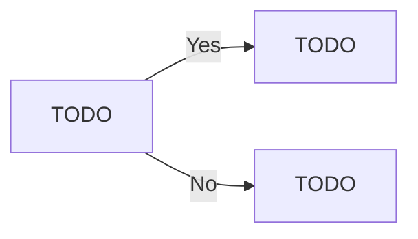

# Content

Welcome to this tutorial on building a First-Person Shooter (FPS) game using Godot. 

This tutorial is designed to guide you through the process of creating an FPS game from scratch, providing step-by-step instructions and explanations along the way.  Godot is a powerful, open-source game engine that is highly flexible and customizable, making it an excellent choice for game development. It supports a variety of platforms and offers a unique and intuitive scene system.  In this tutorial, we will cover key aspects of game development such as setting up the player character, implementing movement and shooting mechanics, creating enemies, and designing levels. We will also delve into more advanced topics such as raycasting and scripting.  By the end of this tutorial, you will have a fully functional FPS game that you can further customize and expand upon. Whether you're a seasoned developer or just starting out in game development, this tutorial will provide valuable insights into the process of creating an FPS game in Godot.  Please note that this tutorial is written for Godot v3.5.1. If you're using a different version of Godot, some steps may vary.  Let's get started!

> These instructions are written for Godot v3.5.1
{style="note"}

## Main Menu {id="MainMenu"}

### Create the Main Menu Scene

Click on the 2D Scene option under Create Root Node.


Rename the Node “Main Menu”


Right Click on the Main Menu Node and choose “Create Child Node” and add a Button.


Set the Text of the button to “Play” or whatever you want.


Right-click on the Button node and choose Attach Script. Change the name of the script to `SceneChange.gd` as this may be used in different circumstances.


With the button selected, change to the Node tab and double click the `pressed()` signal.


Select the Button in the list and click Connect.


Save the Scene as `MainMenu.tscn`.

<include from="reusableContent.topic" element-id="commitPush"/>

### Create the Game Scene

Choose Scene→New Scene. And Choose 3D Scene as the root Node.


Rename the scene node appropriate for your game.


Save the scene, naming it appropriate to your game.


### Create a Button


> You can configure the main menu in any way you want, displaying the button/s wherever you want. These steps just show creating the button and the functionality.
{style="note"}

Right click on the Main Menu node and create a child Button node.


Right-click on the button and Attach a Script. Call this script `SceneChange.gd`. This script will be used for any and all scripts where the button changes scenes.


With the button selected, click on the Node tab, next to the Inspector, and double click on the `pressed(`) signal.


Make sure Button is selected in the “Connect To script” section. Leave the Receiver Method as is, and just click connect.


At the top of the script after the `extends` line, add `export(String) var scene_to_load.`

Change the `pass` line of code to `get_tree().change_scene(scene_to_load)`.


<include from="reusableContent.topic" element-id="commitPush"/>


### Link the Main Menu to the Game Scene.

Open the Main Menu scene.

Right-Click on the game scene you just saved in the FileSystem tab and choose Copy Path.


Paste that Path into the `Scene To Load` field for the Button created earlier.


### Run the Game

Press the play button to run the game. If this is the first time the project has been run, you’ll be asked to choose a Main Scene.

If the Main Menu Scene is open, you can just choose Select Current.

If you have another scene open, choose Select, and then double-click on the `MainMenu.tscn`.


<procedure title="Changing Starting Scene" collapsible="true">
    <step>Changing the Starting Scene can be set in the Project Settings</step>
    <step>Screen_Shot_2022-08-05_at_10.55.43_am.png</img>
</step>
</procedure>


### Continue developing the Main Menu

Once the initial configuration is complete (connecting the main menu to the first game scene, you are free to improve the main menu as much as you want. Add `VBoxContainers` and `HBoxContainers` to organise the layout to assist with placement of items.

- Add Headings and graphics. 
- The Main menu developed can be continued in the future at any stage of the development process.

## Environment - Rapid Development

### Create a Floor

To start with, the player will need to walk on something, so the first step is to create a `MeshInstance` which will be the floor of the room where the player starts.

Right-Click on the Game scene and choose Add Child Node. Search for Mesh Instance.


Rename the node “Floor” or “Ground” or whatever is appropriate.


In the Inspector, look for the Mesh attribute. in the dropdown box, choose `New PlaneMesh`.

At this stage, the mesh is there, but the player (created later) will fall straight through it.


With the mesh selected, go to the Mesh Menu and choose Create Trimesh Static Body.


This updates the mesh to include 2 child nodes.


Currently, the floor is quite small. The player object that will be created later will be quite significantly larger, so the relative scale will need to be addressed.

Edit the mesh.


Set the x and y size values to something larger. In this case, 20 has been used. This may need to be modified at a later date.


### Texture the floor

> A Texture is simply an image that’s applied to a mesh.
{style="note"}

Find an image to suit the environment appropriate for the game.

> TIP: When googling, add the word “seamless” to your image searches. This means that the edges of the image align with the opposite side, meaning that when the image is tiled on a mesh, no edging will be visible.
{style="note"}


In the inspector, expand out the Material dropdown.


There is currently no material attached, hence why the mesh is white. Click on the dropdown next to [empty] and choose New Spatial Material.


In the menu that appears, expand `Albedo`.

> Albedo is the default type for textures. There are many more as you can see in the list.
{style="note"}


Drag the texture from the FileSystem tab to the Texture option under Albedo. The texture on the plane has been updated.


> This is the same process to texture any of your other assets, unless they’ve been textured prior to importing.
{style="note"}

The texture can be ‘tiled’ instead of stretched, by editting the x and y values under `Uv 1`.

Choose values that suit the needs of the game and the desired effect.


### Add Lighting

The scene at this stage is too dark for the player. Right click on the Root Node, choose Add Child Node, search for and add a `DirectionalLight`.


With the `DirectionaLight` selected, enable Shadows in the Inspector.

Set the Rotational Degrees so that the light is roughly coming down from ‘the sky’ and creates the appropriate shadows.

The exact values don’t matter.


### Build your Environment

Find, import and put your environment models into your scene.

You may wish to add walls, or fences.

At this stage, keep it simple and get a good example of your first scene.

Similar to the Main Menu, the environment can be further developed at a later stage of the development process.

## First-Person Player Scene

As this game is a First-Person Shooter, there is no need to create a mesh for the player object; as in the game, the player will never see it.

Therefore, the player object can be initially created with a simple collider and camera.

There are two main steps to creating the player:

1. Making the player scene, creating nodes etc, and
2. Coding the functionality.

### The Player Scene

Create a new Scene.

Create the root node as `KinematicBody`. To do this, click on Other Node and search for `KinematicBody` and choose Create.

Save the scene as `Player.tscn`.


Add a child node—`CollisionShape`.

This will represent the boundaries of the player node in the game. It will be used as the players ‘hit box’ (officially the **collider**) to detect collisions - walls, floors, projectiles etc.


With the CollisionShape selected, create a new Capsule Shape.


Rotate the capsule so it’s vertical (to represent the boundaries of the player).


Resize the dimensions of the capsule, but clicking drop down box next to Capsule Shape and choose Edit.


Set the Radius and height to values that suit your game.

> You may find these values need to be modified later to better suit your game.
{style="note"}


### Camera

The player has been created, however, the player cannot ‘see’ as a camera has not been added. The camera is what the user sees in game. In a FPS, the mouse is attached to the player object and therefore the camera. When the mouse moves, the camera moves to match.

Add a Camera child node to the Player node.


Set the Environment attribute to the `default_env.tres` already created in the project.


Set this camera to be the ‘main’ camera by setting the Current attribute to True.


Move the camera up the ‘body’ to appear as if the camera ‘sees’ through the players eyes.

> Exact value is not critical, but it has to suit your capsule size set earlier.
{style="note"}

Only change the `Y` value. This is the vertical value. The coordinate system will be discussed at a later time.


### Key Actions

Before any scripting can be done, some keyboard and mouse inputs need to be mapped to actions (to be coded later).

<procedure title="Set Input Keys" id="inject-a-procedure">
    <step>
        <p>Open the `Project` menu</p>
    </step>
    <step>
        <p>Select Project Settings</p>
    </step>
    <step>
        <p>Select Input Map</p>
    </step>
</procedure>

Add the following actions and set the keys and mouse inputs as directed.

`player_forward`

`player_backward`

`player_left`

`player_right`

`jump`

`shoot`

> Pay close attention to the spelling and capitalisation. These will be linked to in the script later.
{style="note"}


### Mouse Look

Open `Player.tscn`. Right click on the root node and attach a script. Leave the settings as they are, and click Create.


Clear out the commented code, and add some variables which will be used later in the script.

These variables define how fast the player moves and how jumping and gravity impact the players movement.


```
extends KinematicBody

# Physics
var movementSpeed = 1.0 		# How fast the player can move.
var jumpStrength = 1.0 		# How much force used to make player jump
var gravity = 10.0			# Gravity's strength.

# Called when the node enters the scene tree for the first time.
func _ready():
    pass # Replace with function body.
```
{collapsible="true"}

Add other variables. These variables define the player movement and camera movement limitations.


```
# cam look
var minCamVerticalAngle = -90.0		# Limit camera view to straight down.
var maxCamVerticalAngle = 90.0		# Limit camera view to straight up.
var lookSensitivity = 0.5			# How fast camera moves. 'mouse sensitivity'. 

# vectors
var playerVelocity : Vector3 = Vector3() 	# Players Velocity
var mouseDelta : Vector2 = Vector2()			# How much the mouse has moved since last frame refresh.

# player components
onready var camera = get_node("Camera")		# "attach" the camera to access from script.
```
{collapsible="true"}


Add the function to detect mouse movement.


```
# called when an input is detected
func _input (event):
    # did the mouse move?
    if event is InputEventMouseMotion:
        mouseDelta = event.relative
```
{collapsible="true"}


Add the function to rotate the camera to match the mouse movements.


```
# called every frame
func _process (delta):
    # rotate camera along X axis
    camera.rotation_degrees -= Vector3(rad2deg(mouseDelta.y), 0, 0) * lookSensitivity * delta
    # clamp the vertical camera rotation
    camera.rotation_degrees.x = clamp(camera.rotation_degrees.x, minCamVerticalAngle, maxCamVerticalAngle)
  
    # rotate player along Y axis
    rotation_degrees -= Vector3(0, rad2deg(mouseDelta.x), 0) * lookSensitivity * delta
  
    # reset the mouse delta vector
    mouseDelta = Vector2()
```
{collapsible="true"}


At this stage, you can run the game to test the mouse movement. Run the project, click the button on the main menu to play the game, and you should be able to look around your environment.


### Player Movement

Add the `_physics_process` function for player movement. This function can go at the bottom of the `Player.gd` script.


```
# called every physics step
func _physics_process (delta):
    # reset the x and z velocity
    playerVelocity.x = 0
    playerVelocity.z = 0
    var input = Vector2()
    # movement inputs
    if Input.is_action_pressed("player_forward"):
        input.y -= 1
    if Input.is_action_pressed("player_backward"):
        input.y += 1
    if Input.is_action_pressed("player_left"):
        input.x -= 1
    if Input.is_action_pressed("player_right"):
        input.x += 1
    # normalize the input so we can't move faster diagonally
    input = input.normalized()
    # get our forward and right directions
    var forward = global_transform.basis.z
    var right = global_transform.basis.x
    # set the velocity
    playerVelocity.z = (forward * input.y + right * input.x).z * movementSpeed
    playerVelocity.x = (forward * input.y + right * input.x).x * movementSpeed
    # apply gravity
    playerVelocity.y -= gravity * delta
#	print(playerVelocity.y)
    # move the player
    playerVelocity = move_and_slide(playerVelocity, Vector3.UP)
    # jump if we press the jump button and are standing on the floor
    if Input.is_action_pressed("jump") and is_on_floor():
        playerVelocity.y = jumpStrength
```
{collapsible="true"}


Run the game and move around the world.


> At this stage, you may find that some dimensions are not perfect. You may find you need to change one or more of the following options:
> - Camera’s vertical position in the Player Scene.
> - Scale of the floor node.
> - Jump Strength
> - Gravity
> - Etc.
{style="note"}


NOTE: If you change the scale of the floor, you’ll need to delete the Static Body child and recreate it by selecting Mesh→Create Trimesh Static Body.

### Add the Player to the Scene

Open the Scene/s that you wish to add the player to.

Drag the player tscn file into the hierarchy.


Run the game or scene and you should be able to ‘see’ through the cameras ‘eye’.

### Player Run Functionality

To implement a simple run functionality, `Player.gd` can be updated to modify `movementSpeed` based on whether the shift key is held down or not.

First, add a new Input into the Project Settings → Input Map page.

Then add the shift key to that map.


Open `Player.gd` and find the `_physics_process(delta)` function. Add the following if statement to set `movementSpeed` to change based on the button press.


> The exact speed values can be modified based on the requirements of the game.
{style="note"}


```
if Input.is_action_pressed("run"):
        movementSpeed = 20
    else:
        movementSpeed = 10
```
{collapsible="true"}

## Reusable Assets

One of the areas of game development that can save you a lot of work in the long run is building assets that you can reuse throughout your game.

For instance, you can build one ‘master’ copy of a traffic light, and then have multiple traffic lights throughout the game, all based on the same asset.

> The added benefit to this is that once you have multiple copies of an asset, if you update the master, then all the copies get updated too.
{style="note"}

This will be demonstrated here by building a segment of wall that can be duplicated and be used to build a complex room structure.

Start by creating a new scene and set the root node to be a 3D Scene.


Rename the node from Spatial to Wall.


Build the mesh of the asset you are building. This part of the process will depend on what you’re developing.

> Anything beyond the simple ‘block’ shapes may require some 3D modelling software, such as Blender, but that’s beyond the scope of this tutorial. If you’re interested in 3D modelling, there are many tutorials available on Youtube.
{style="note"}


For the wall segment, this can be built by creating a CSGBox as a child node of `Wall`.


Change to scale mode to resize the box into the shape that you want.


Save the Scene.


Open the scene that you wish to edit, and drag the `tscn` file you just saved into the position you wish to to be in.


You can duplicate the node and place the duplicates in position.

Save the Scene once completed.


To edit the master, for instance by applying a texture, open the `tscn` file you saved, make changes and save.

Once you save the `tscn` file, the instances are automatically updated in the other scene.


## Bullet Implementation

There are many ways to implement shooting in an FPS (or other type of) game. One method is to use **raycast**s, where the there is an imaginary line drawn from the camera, and seeing what object it hits first (if any).

Another method, which is the focus of this tutorial, is to create projectiles (such as bullets) for the player to shoot. The bullets will hit objects in their direct path, and can cause damage.

> What are the pros and cons of each approach? Why choose one over the other?
{style="note"}

### Bullet Mesh

> This tutorial is going to demonstrate how to create a simple bullet. Your implementation for the model may differ, however the process should be the same.
{style="note"}

Create a new Scene (Scene→New Scene).

Set the Root Node as `Area` by selecting Other Node and search for Area.


Create your bullet model. You can create your own mesh, or you can follow the instructions shown below.

#### Simple Bullet

For a simple bullet shape, this can be done by creating a CSGCylinder and a CSGSphere and manipulating (move and rotate) them into a bullet shape.


Create both of these CSG objects with Union Operation selected


Then place them as children of a `CSGCombiner`. Name the new node as appropriate.


Texture the object as you would normally.


Attach a `CollisionShape` node as a child of the scene root.


With the CollisionShape selected, set the Shape to be Capsule.


Manipulate the Capsule shape so that it completely surrounds the mesh.


Rename the Scene Root as `Bullet`.


Save the scene as `Bullet.tscn`


### Bullet Script

Still in the Bullet scene, attach a new script to the root node (Bullet) and name it `Bullet.gd`.


Aside from `extends Area`, remove the default code, and add two new variables.

`speed` defines how fast the bullet will move through the game.

`damage` is how much damage the bullet can deal out.

> These can be set to whatever values are appropriate.
{style="note"}


> This can be used to allow for different weapons with different bullet speeds and damage.
{style="note"}


```
var speed : float = 30.0
var damage : int = 1
```
{collapsible="true"}

Add code, within the `_process` function to move the bullet instance forward.


```
func _process (delta):
    # move the bullet forwards
    translation += global_transform.basis.z * speed * delta
```
{collapsible="true"}

Save the Script.

Select the root node (Bullet) and change to the Node tab.


Double click on `body_entered`. Press **Connect.**

This code will be used to detect when the bullet instance has collided with another object - when the bullet collider enters another node’s collider.


In order to only destroy objects that need to be destroyed, this code will first check if the other collider has a function called `take_damage` in its script. This means that a script attached to the enemy objects can have that function, and will take damage, however a wall doesn’t need that function, so it won’t be destroyed.

`_on_Bullet_body_entered(body)` executes when the bullet enters another object. If that object has the `take_damage()` function (or method), it will then run that function on the other node, passing the `damage` value.

Also added is the `destroy()` function. This simply deletes the bullet from the game.

This has been added in such a way to allow for future modification as required.

<tabs>
<tab title="Image"></tab>
<tab title="Code">

```
func _on_Bullet_body_entered(body):
    if body.has_method("take_damage"):
        body.take_damage(damage)
        destroy()

func destroy ():
    # destroys the bullet
    queue_free()
```

</tab>
<tab title="Logic">


</tab>
</tabs>


### Automatically deleting the bullet

A potential problem with creating instances of bullets is that the player could create 1000s of bullets that would continue running in the game, flying off into the distance, taking up valuable processing power. A solution for this problem is to automatically delete the bullets after a set time.

In the bullet scene, create a **Timer** child node of the root note


Set the wait time to something appropriate, and Autostart to On.


Change to the Node tab and double-click on the `timeout()` signal.

Set the Receiver Method to `destroy`.

Select Connect.


Save the Bullet Scene.


## Shooting Bullet Instances

> **Prerequisites** - A bullet scene needs to have been created and saved according to the instructions given on this site. If you have created your own method, you will have to adapt this as necessary.
{style="note"}

With the bullet created, the game now needs to be configured to *shoot* the bullet. Initially, this will be done in the player script.

First, the code will need to know **where** to create the bullet instances.

Open `Player.tscn` and create a Spatial node as a child of the Camera. Name it `bulletSpawn`.


In 3d mode, move `bulletSpawn` to be in front of the camera.

> It might take some experimentation to make it look correct during game play. You may need to change the position a number of times.
{style="note"}


Open `[Player.gd](http://Player.gd)` and add the code to preload the bullet and configure the spawn point.

`onready` is a keyword that creates the variable once the scene has been fully loaded.

> Important—the path to the bullet scene and the bulletSpawn point need to be **exactly** as you’ve defined them in your project. If they are named as something else, your code needs to reflect that.
{style="note"}


```
onready var bulletScene = preload("res://Bullet.tscn")
onready var bulletSpawn = get_node("Camera/bulletSpawn")
```
{collapsible="true"}

Add a new variable to keep track of the ammunition the player is carrying.

Set the value to something appropriate for your project.


```
var ammo : int = 15
```

Update `process()` to check to see if the player has pressed the `shoot` input.


```
if Input.is_action_just_pressed("shoot"):
        shoot()
```
{collapsible="true"}

Create a new function - `shoot()`- which will run when the shoot input is detected.


> Change `/Root/Doom` to the name of your root node in the game scene. E.g. `/Root/MainGame`
{style="note"}


```
func shoot ():
    var bullet = bulletScene.instance()
    get_node("/root/Doom").add_child(bullet)
    bullet.global_transform = bulletSpawn.global_transform
    bullet.scale = Vector3(0.1,0.1,0.1)

    ammo -= 1
```
{collapsible="true"}

Run the game at this stage to test the creation and shooting of bullet instances.

